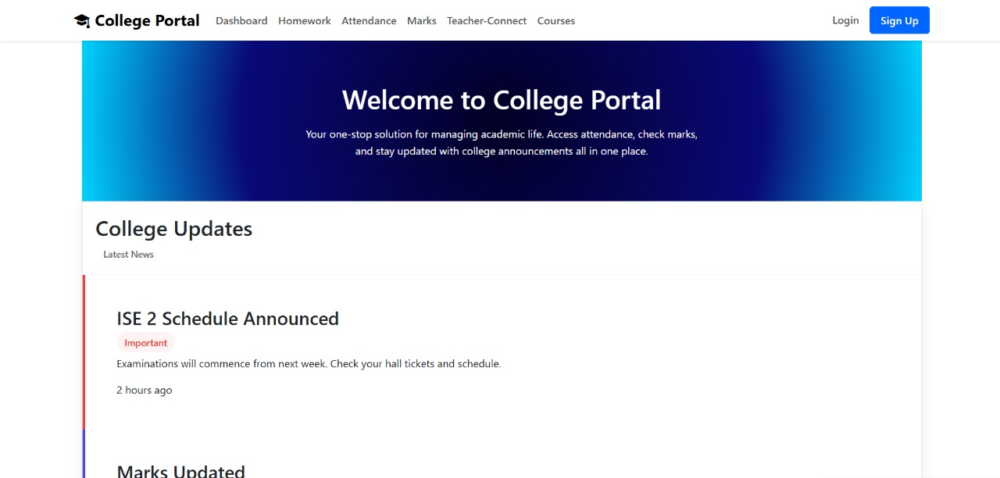
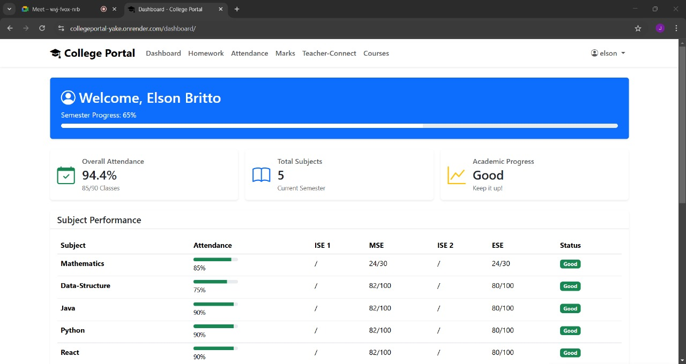
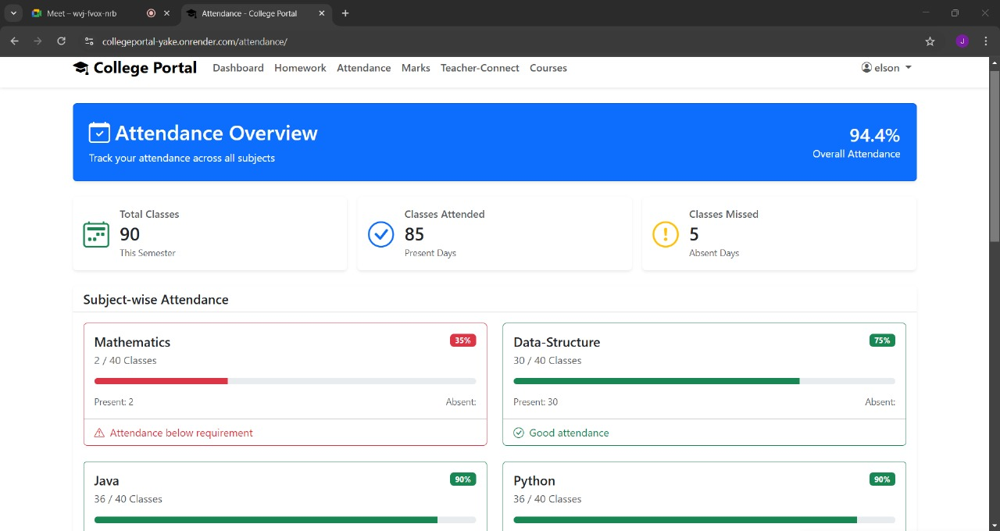
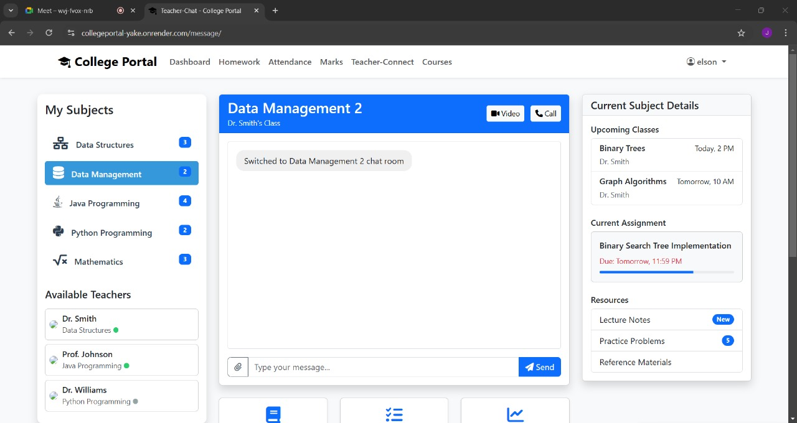
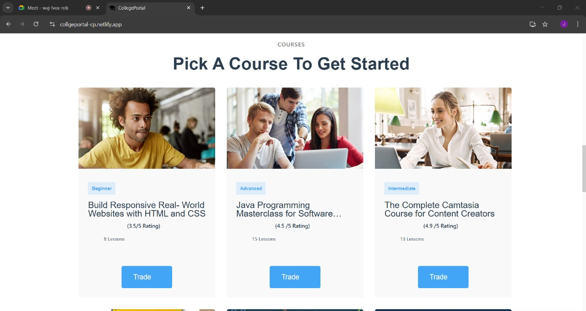
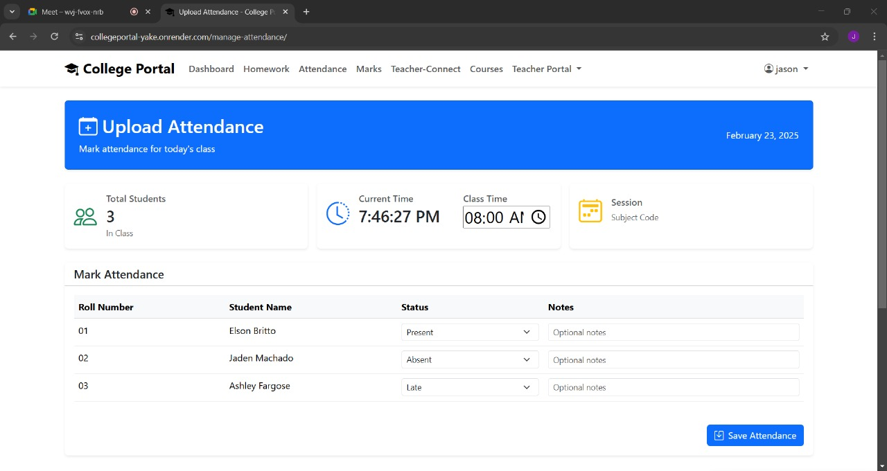
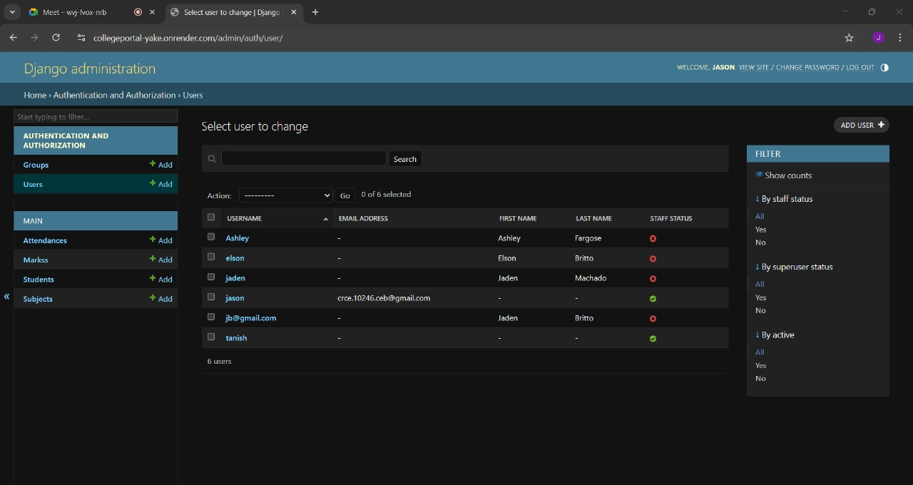

# College Portal 🎓📚
A smart and efficient classroom management platform designed to enhance the learning experience for both students and teachers. This platform streamlines classroom management tasks such as attendance tracking, academic progress monitoring, interactive teacher-student communication, and homework management.  

## 🚀 Live Demo
[Click here to try CollegePortal](https://collegeportal-yake.onrender.com/)

## YouTube Demo 🎥

## Features 🌟
🔐 User Authentication: Separate logins for students and teachers/admins.  
🏠 Dashboard: Overview of academic progress, college updates, and notifications.  
📊 Attendance Tracking: Automated attendance management system for students and teachers.  
📈 Marks Management: View and track academic performance over time.  
📝 Homework Management: Assignments and homework tracking for students and teachers.  
💬 Teacher-Connect (Live Chat & Video Calling): WebSocket-based real-time chat system for student-teacher interaction.  
📚 Course Management: View and manage enrolled courses.  
🎨 Responsive UI: Modern, user-friendly interface for easy navigation and accessibility.  

## 🛠️ Technologies Used

  HTML
  CSS
   Jvascript
  Bootstrap
  React.js
  Python
  Django  
   Render

## Getting Started ⚡

Prerequisites  
- Python 3.8+  
- Node.js & npm  
- Django & React.js installed  

Installation Steps
1. Clone the repository:  
   git clone https://github.com/Jason3105/CollegePortal.git  
   cd CollegePortal  

2. Backend Setup:  
   pip install -r requirements.txt  
   python manage.py migrate  
   python manage.py runserver

3. Frontend Setup:  
   cd main  
   npm install  
   npm start

## 📁 Project Structure

<pre>CollegePortal/  
│── FRagnel/               # Backend and Django setup  
│── main/                  # React frontend  
│── staticfiles/           # Static assets (CSS, JS, Images)  
│── db.sqlite3             # SQLite database  
│── manage.py              # Django management script  
│── requirements.txt       # Dependencies  
│── README.md              # Project Documentation  </pre>

## 📸 Screenshots

  
  
  
  
  
  
  
